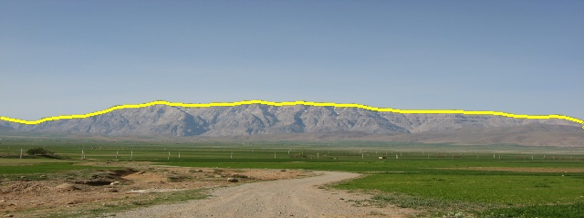

# YUNet: Imprived YOLOv11 Network for Skyline Detection
<div align="center">
  
</div>

## Abstract
Skyline detection plays an important role in unmanned aerial vehicle (UAV) control systems. The appearance of the sky and non-sky areas are variable, because of different weather or illumination environment, which brings challenges to skyline detection. In this research, we proposed the YUNet algorithm, which combined the YOLOv11 and Unet architecture to extract the skyline in complicated and variable circumstances. To improve the ability of multi-scale and large range contextual feature fusion of Unet, the YOLOv11 architecture is extended as an UNet-like architecture, consisting of a encoder, decoder and neck submodule. The encoder submodule extracts the features from the given images, while the decoder submodule leverages the features from neck submodule to compelete the prediction rebuilding. The neck submodule can make fusion of the multiscale and large range contextual features. To validate the approach in this research, it was tested on two public datasets including Skyfinder and CH1 datasets.
## Dataset
There are two expriments about this code, which are sky segmentation and skyline detection. The sky segmentation is run on skyfinder dataset. For the skyline detection, the train process is run on geopose3k dataset, and the validation is run on CH1 dataset.
The three datasets is preprocessed and pubulished at following.
1. **Skyfinder**:  **[Baidu Drive](https://pan.baidu.com/s/1sOKxggMnG6-mlOphwGBZGA?pwd=sic1)** 
2. **geoPose3k**:  **[Baidu Drive](https://pan.baidu.com/s/1JTk_t2krc71Rzv8YD4Xvtw?pwd=ctqj)** 
3. **CH1**:  **[Baidu Drive](https://pan.baidu.com/s/1W_i3PbslT1EyjzkvkNlXXQ?pwd=j9us)**

## Configuration
We add the global configuration file **skyseg.yaml** into the directory of **ultralytics/cfg**. Users can revise the train, validation, and test configuration at **ultralytics/cfg/skyseg.yaml**

We add the dataset configuration file **skyfinder.yaml** and **geoPose3k.yaml** into the directory of **ultralytics/cfg/datasets**. User can set the path of dataset at **ultralytics/cfg/datasets/skyfinder.yaml** and **ultralytics/cfg/datasets/geoPose3k.yaml**
## Train
The entrance of train process is writen into **ultralytics/model/yolo/skyseg/train.py**. After complete the configuration file, Users can train the model by the following command.
```shell
python train.py 
```
## Validation
The entrance of validation process is writen into **ultralytics/model/yolo/skyseg/val.py**. After complete the configuration file, Users can validate the model by the following command.
```shell
python val.py 
```
## Model

<div align="center">

| Benchmark | Accuracy | Precision | Recall | Dice-Score | IoU    | Size | BaiduDrive       | GoogleDrive                                                                                        |
|-----------|----------|-----------|--------|------------|--------|------|------------------|----------------------------------------------------------------------------------------------------|
| YOLOv11-n | 99.195   | 98.308    | 98.834 | 98.513     | 0.9719 |  7.2MB   | **[Download](https://pan.baidu.com/s/1JUHHQchwc9Iect3tJycrgA?pwd=wsuj)** | **[Download](https://drive.google.com/file/d/1RCDWtzL5_ERvy87739BLttqtjtvtdcw5/view?usp=sharing)** |                                                                                  |
| YOLOv11-s | 99.467   | 99.169    | 98.969 | 99.042     | 0.9816 |  24.8MB  | **[Download](https://pan.baidu.com/s/1yZV2C6E_wxwkpKjWYtt3Pg?pwd=ijwh)** | **[Download](https://drive.google.com/file/d/1wQefjuXMKrQLT-FZ2opcwXy5FOYc07vz/view?usp=sharing)** |
| YOLOv11-m | 99.479   | 99.382    | 98.809 | 99.078     | 0.9821 |  51.4MB  | **[Download](https://pan.baidu.com/s/1VsBZmojjjyp5agSnIZ7hxQ?pwd=c7hh)** | **[Download](https://drive.google.com/file/d/1QXPhs1KWEiD_Ze0QyLLXEtHf5ghd0z2G/view?usp=sharing)** |                                                                                  |
| YOLOv11-l | 99.406   | 99.186    | 99.034 | 99.036     | 0.9824 |  65.3MB  | **[Download](https://pan.baidu.com/s/1_ZsF2VAtuL075ZXlHfXsKg?pwd=wu1p)** | **[Download](https://drive.google.com/file/d/1HbZxLND7ojvegxyL_DKpp5NSIr6_ScWf/view?usp=sharing)** |                                                                                  |
| YOLOv11-x | 99.565   | 99.465    | 99.101 | 99.253     | 0.9858 |  145.8MB | **[Download](https://pan.baidu.com/s/1nEDZQcy6FVKWGCnClok5Jg?pwd=r93m)** | **[Download](https://drive.google.com/file/d/11FdmWxOKi0qHi_s8OZFkj4LF99UoB3GG/view?usp=sharing)** |


</div>


<div class="markdown-heading" dir="auto"><h2 tabindex="-1" class="heading-element" dir="auto">Citation</h2><a id="user-content-citation" class="anchor" aria-label="Permalink: Citation" href="#citation"><svg class="octicon octicon-link" viewBox="0 0 16 16" version="1.1" width="16" height="16" aria-hidden="true"><path d="m7.775 3.275 1.25-1.25a3.5 3.5 0 1 1 4.95 4.95l-2.5 2.5a3.5 3.5 0 0 1-4.95 0 .751.751 0 0 1 .018-1.042.751.751 0 0 1 1.042-.018 1.998 1.998 0 0 0 2.83 0l2.5-2.5a2.002 2.002 0 0 0-2.83-2.83l-1.25 1.25a.751.751 0 0 1-1.042-.018.751.751 0 0 1-.018-1.042Zm-4.69 9.64a1.998 1.998 0 0 0 2.83 0l1.25-1.25a.751.751 0 0 1 1.042.018.751.751 0 0 1 .018 1.042l-1.25 1.25a3.5 3.5 0 1 1-4.95-4.95l2.5-2.5a3.5 3.5 0 0 1 4.95 0 .751.751 0 0 1-.018 1.042.751.751 0 0 1-1.042.018 1.998 1.998 0 0 0-2.83 0l-2.5 2.5a1.998 1.998 0 0 0 0 2.83Z"></path></svg></a></div>
<div class="snippet-clipboard-content notranslate position-relative overflow-auto" data-snippet-clipboard-copy-content="@misc{yang2025yunetimprovedyolov11network,
      title={YUNet: Improved YOLOv11 Network for Skyline Detection}, 
      author={Gang Yang and Miao Wang and Quan Zhou and Jiangchuan Li},
      year={2025},
      eprint={2502.12449},
      archivePrefix={arXiv},
      primaryClass={cs.CV},
      url={https://arxiv.org/abs/2502.12449}, 
}"><pre class="notranslate"><code>@misc{yang2025yunetimprovedyolov11network,
      title={YUNet: Improved YOLOv11 Network for Skyline Detection}, 
      author={Gang Yang and Miao Wang and Quan Zhou and Jiangchuan Li},
      year={2025},
      eprint={2502.12449},
      archivePrefix={arXiv},
      primaryClass={cs.CV},
      url={https://arxiv.org/abs/2502.12449}, 
}

</code></pre></div>


